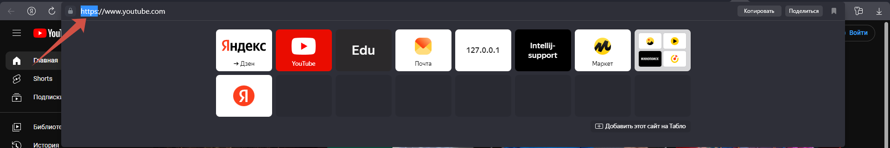
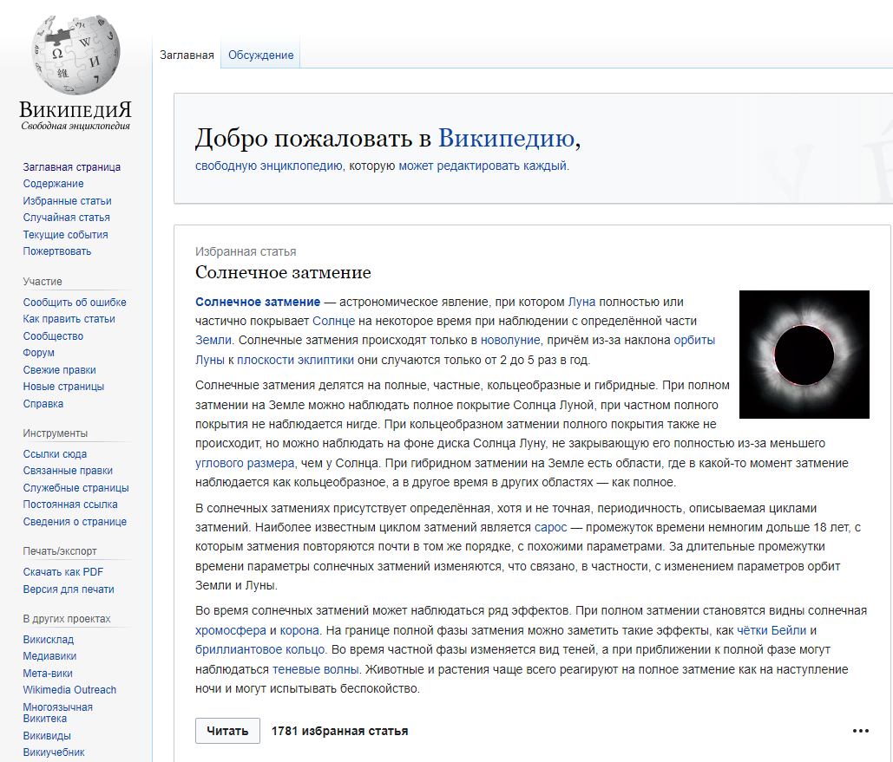
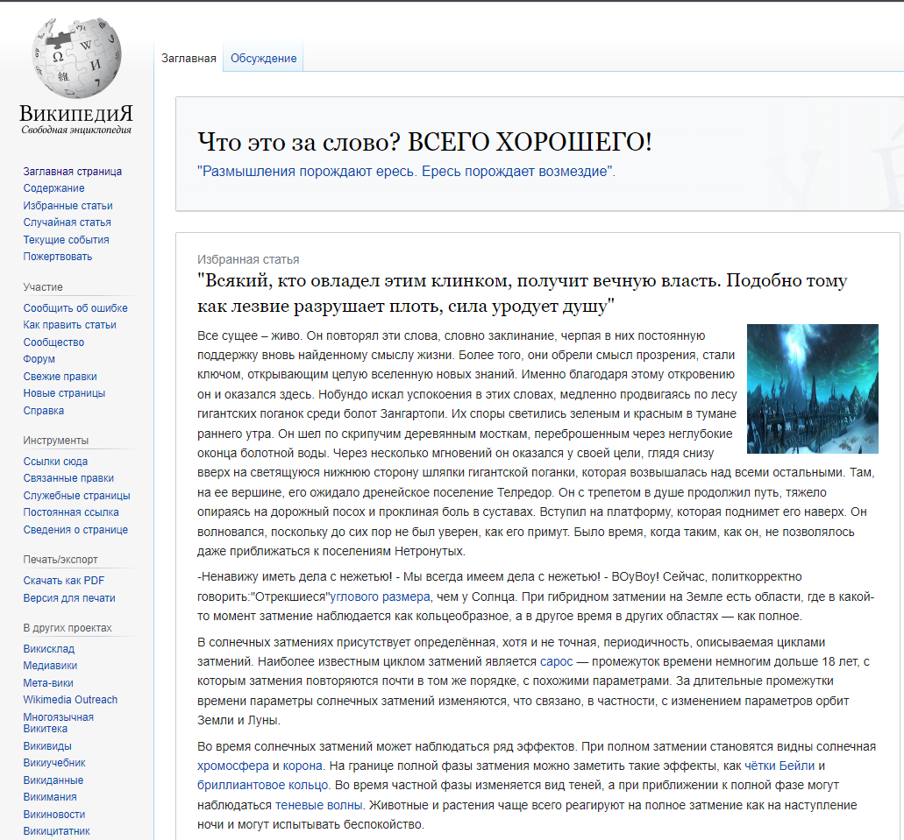
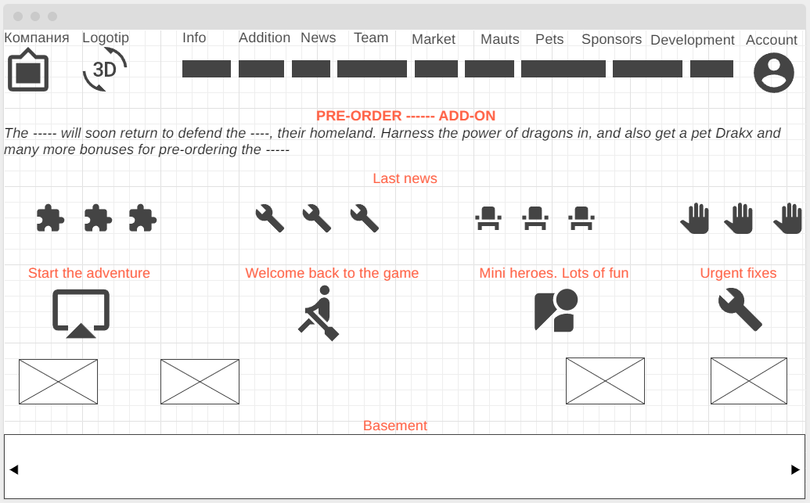

# **Определите, на каком протоколе работает сайт youtube.com**
## Сайт youtube.com работает по протоколу hhtps
* Один из вариантов, как можно это понять:

#  **Внесите не менее 10 изменений на страницу любой статьи сайта https://ru.wikipedia.org/**
* **До:**

* **После:**

# **Создайте прототип низкой детализации сайта https://dzen.ru/ с помощью сайта https://wireframe.cc/.**

